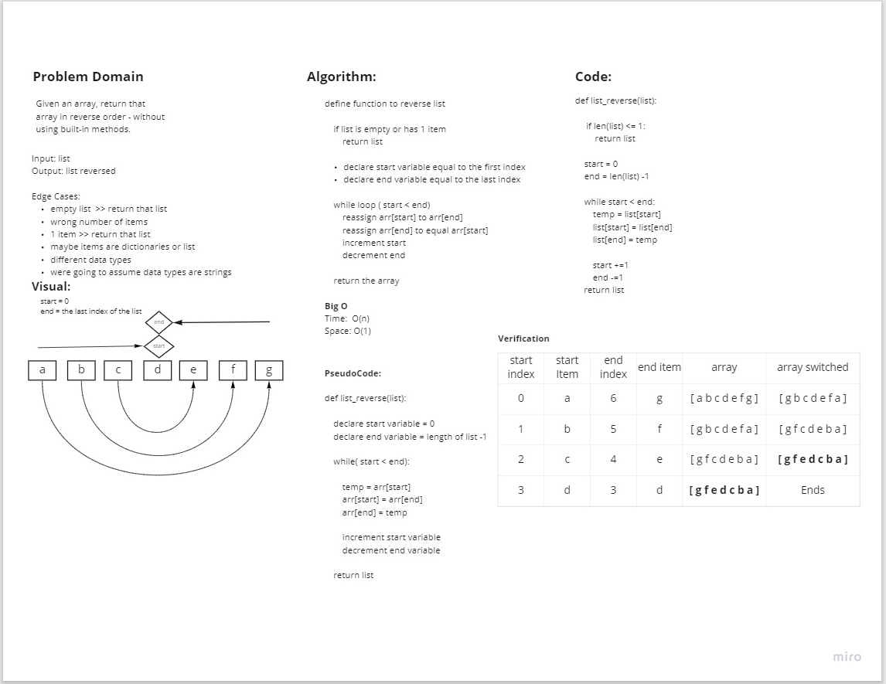

## Code Challenge 01: Reverse an array/list.

Write a function which takes an array as an argument. Without utilizing any of the built-in methods available to your language, return an array with elements in reversed order.

| Input    |    Output |
| --- | --- |
| [1, 2, 3, 4, 5 ]   ->|    [5, 4, 3, 2, 1] |

### Whiteboard Process

### Change Log

1.1: Completed whiteboarding process - 07 Jun 2021
