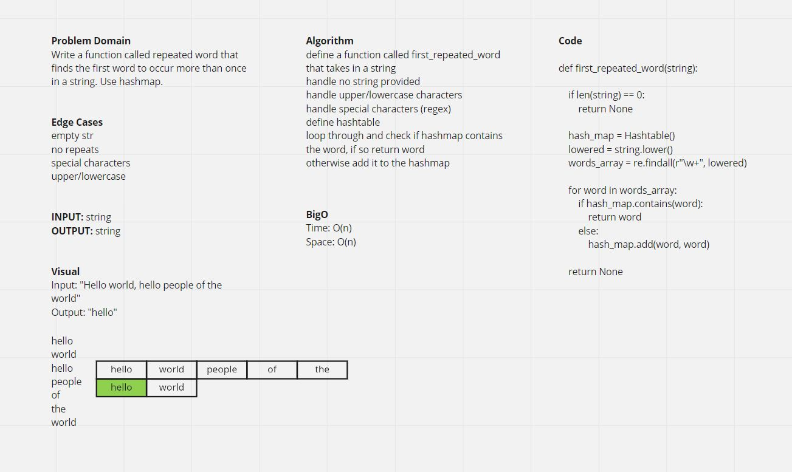
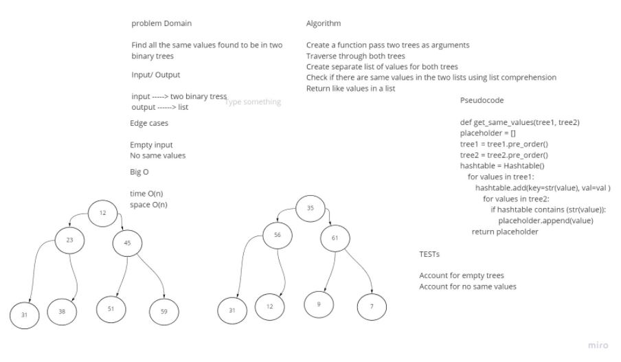
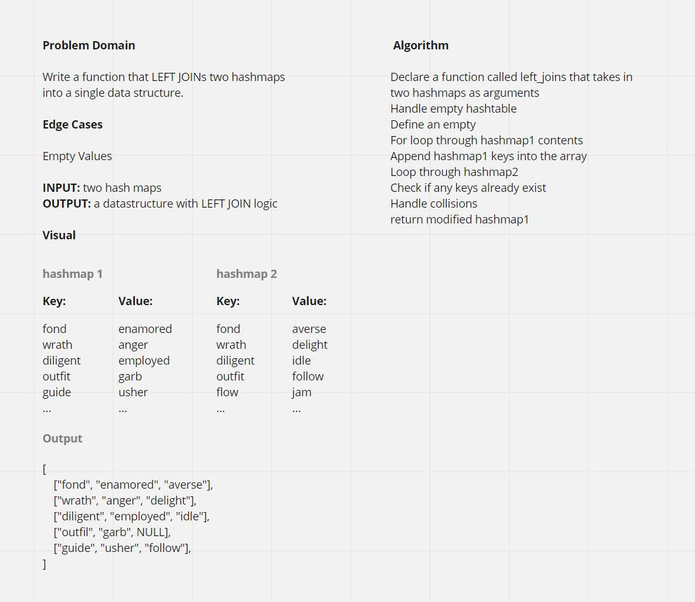

# Hashtable

## Features

Implement a Hashtable Class with the following methods:

**add**
Arguments: key, value
Returns: nothing
This method should hash the key, and add the key and value pair to the table, handling collisions as needed.

**get**
Arguments: key
Returns: Value associated with that key in the table
contains
Arguments: key
Returns: Boolean, indicating if the key exists in the table already.

**hash**
Arguments: key
Returns: Index in the collection for that key
Structure and Testing

Utilize the Single-responsibility principle: any methods you write should be clean, reusable, abstract component parts to the whole challenge. You will be given feedback and marked down if you attempt to define a large, complex algorithm in one function definition.

## Write tests to prove the following functionality

Adding a key/value to your hashtable results in the value being in the data structure
Retrieving based on a key returns the value stored
Successfully returns null for a key that does not exist in the hashtable
Successfully handle a collision within the hashtable
Successfully retrieve a value from a bucket within the hashtable that has a collision
Successfully hash a key to an in-range value

# Hashtable Repeated Word

## Feature Tasks

Write a function called repeated word that finds the first word to occur more than once in a string

- Arguments: string
- Return: string

## Whiteboard

# Hashmap Tree Intersection

## Feature Tasks

Find common values in 2 binary trees.

- Arguments: two binary trees
- Return: array

## Whiteboard

# Hashmap Left Join

## Feature Tasks

Write a function that LEFT JOINs two hashmaps into a single data structure.

- Arguments: two hash maps.
The first parameter is a hashmap that has word strings as keys, and a synonym of the key as values.
The second parameter is a hashmap that has word strings as keys, and antonyms of the key as values.

- Return: a datastructure with LEFT JOIN logic

## Whiteboard

## Collaborators

- Davee Sok
- Woondwosen Tsige
- Prabin Singh
- Daniel Dills
- Garfield Grant

## Resources

[GeeksforGeeks](https://www.geeksforgeeks.org/python-intersection-two-lists/)

[TechieDelight](https://www.techiedelight.com/preorder-tree-traversal-iterative-recursive/)
