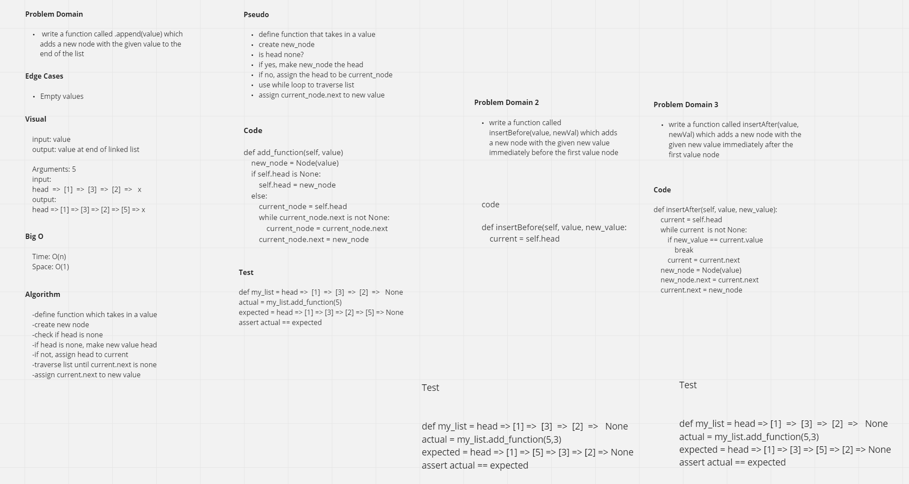
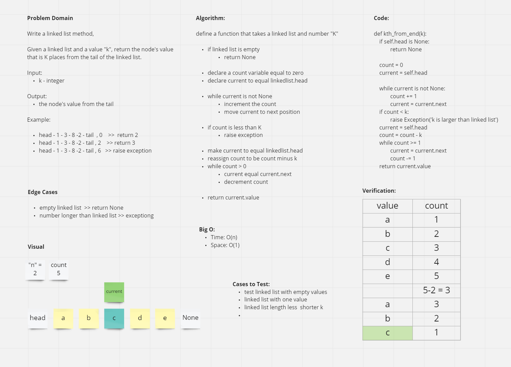
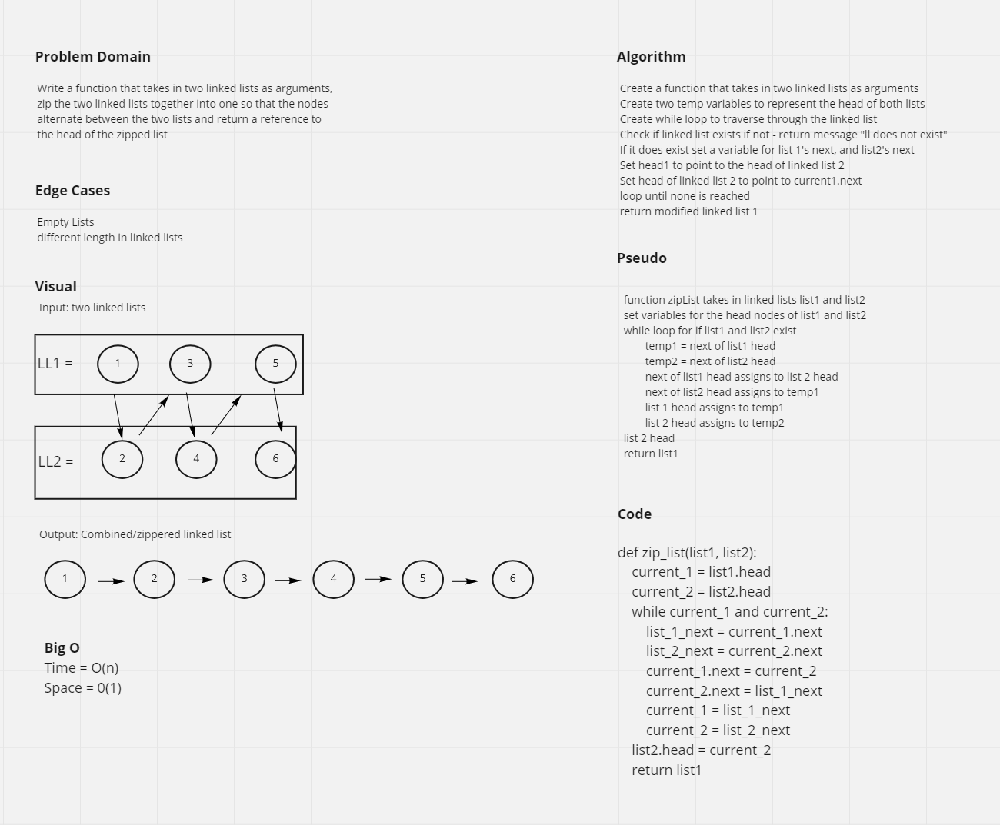

# Challenge Summary 1
 Write a function called .append(value) which adds a new node with the given value to the end of the list

 Write a function called insertBefore(value, newVal) which adds a new node with the given new value immediately before the first value node

Write a function called insertAfter(value, newVal) which adds a new node with the given new value immediately after the first value node

## Whiteboard Process

# Challenge Summary 2
Write a function that returns the node’s value that is k places from the tail of the linked list.

## Whiteboard Process

# Challenge Summary 3
Write a function that takes in two linked lists as arguments, zip the two linked lists together into one so that the nodes alternate between the two lists and return a reference to the head of the zipped list.

## Whiteboard Process

### Change Log

1.1: Completed whiteboarding process - 14 Jun 2021
1.2: Completed whiteboarding process for ll kth from end - 24 Jun 2021
1.3: Completed whiteboarding process for zipList - 28 Jun 2021

