# Insertion Sort

Insertion sort is a sorting algorithm where the list/array is sorted by comparing one item at a time. Elements are compared with each other sequentially and then arranged simultaneously. An element is taken out of the list and inserted back into a particular position based on comparison results.

## Example

We will begin with the given list:

[8,4,23,42,16,15]

First start a for loop beginning at index 1 that will loop through as many times as their are items in the lists. This is so that we may pass through the entire array and analyze it's contents. We start at index 1 because index 0 will be compared on the first passthrough as we'll see below.

In this case, the item at index 1 is 4.

Take out the value found at index 1 and store it in a variable called 'temp' for temporary holding.
A second variable called 'position' will represent the temp values index - 1; or in other words, the index immediately left of temp.

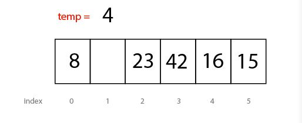

Compare the value of position to the value of temp.
So now we are comparing 8 to 4.

8 is greater than 4, therefore 8 gets shifted to the right

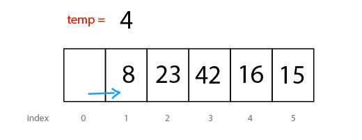

With no more comparisons to make on the left side, 4 gets inserted into the spot 8 left behind.

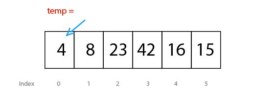

Now that index 1 has been sorted, move on to index 2.

Assign index 2 to temp.

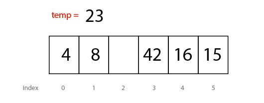

Compare the left values, starting at index 1.
Index 1 is lower,  therefore no shift will be made and no need to compare index 0, as it had already been analyzed.

Insert index 2 back into its spot.

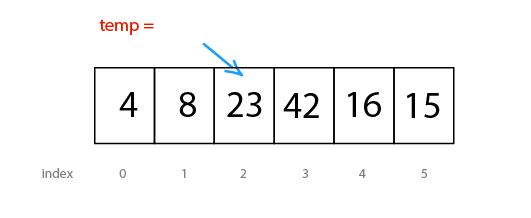

On the next pass through assign index 3 to temp.

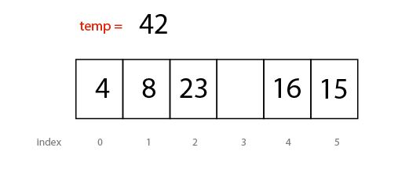

Compare index 2: it is found to be lower: make no changes 42 returns to its spot.

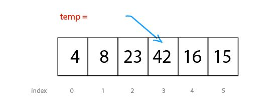

On the next pass through assign index 4 to temp.

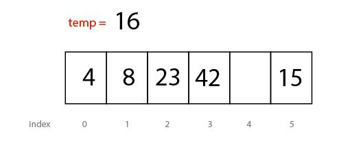

Index 3 is higher: shift it right. Index 2 is higer: shift it right as well.

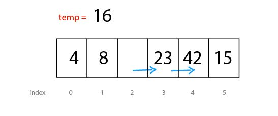

Index 1 is lower: insert temp into the gap index 2 left behind.

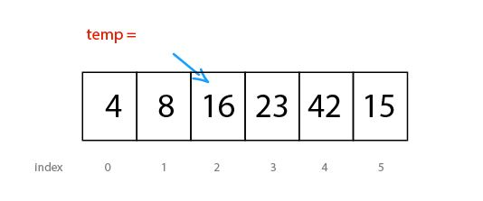

On the next pass through assign index  5 to temp.

Index 4 is higher: shift it right. Index 3 is higer: shift it right. Index 2 is higer: shift it right.

Index 1 is lower, insert temp into the gap index 2 left behind.

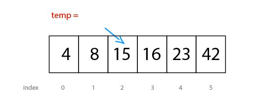

We have reached the end of the list and the list is now sorted.

