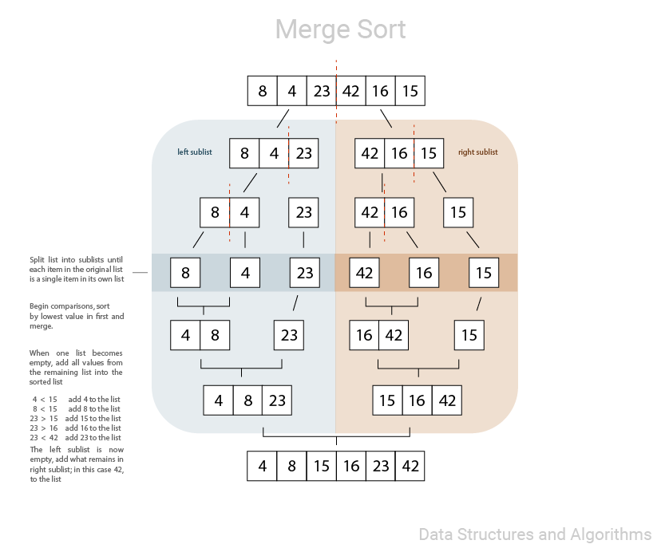

# Merge Sort

Merge sort first divides the given unsorted list into two halves then recursively calls itself to divide the two halves further into n number of sublists which each contain one element.

The sublists are then repeatedly compared, sorted, and merged back together until only one sorted list remains.

### Input: [8,4,23,42,16,15]
### Output: [4,8,15,16,23,42]

## Visual

## Pseudo

    ALGORITHM Mergesort(arr)
        DECLARE n <-- arr.length

        if n > 1
        DECLARE mid <-- n/2
        DECLARE left <-- arr[0...mid]
        DECLARE right <-- arr[mid...n]
        // sort the left side
        Mergesort(left)
        // sort the right side
        Mergesort(right)
        // merge the sorted left and right sides together
        Merge(left, right, arr)

    ALGORITHM Merge(left, right, arr)
        DECLARE i <-- 0
        DECLARE j <-- 0
        DECLARE k <-- 0

        while i < left.length && j < right.length
            if left[i] <= right[j]
                arr[k] <-- left[i]
                i <-- i + 1
            else
                arr[k] <-- right[j]
                j <-- j + 1

            k <-- k + 1

        if i = left.length
        set remaining entries in arr to remaining values in right
        else
        set remaining entries in arr to remaining values in left

## Pseudo Explained

    Declare function merge_sort that takes in an array/list.
    Declare 'n' as the length of the given list.
    If list length is greater than 1:
    Determine the middle of the list, divide it into two and represent the halves with variables of 'left' and 'right'.

    Recursively call the function on the left and right halves until the lists are split into smaller lists each containing one item.
    Declare variables 'i' , 'j' = 0 to reference left-most index of list and variable k = 0 to keep track of the index in merged array.

    While each index is less than its list length:
    Begin comparisons of values between left array at index 'i' and right array at index 'j'.
    If left index is less than right index:
    save it to the merged array and increment i
    Otherwise:
    the right index is smaller or equal to left index, so save it to the merged array and increment j and k

    While any value is remains in left sublist:
    add it to the list, increment i and k
    While any value is remains in right sublist:
    add it to the list, increment j and k
    Return the list

## Big O

**Time:** O(nlogn)

**Space:** O(n)

[See Code](https://github.com/Mmarcos01/data-structures-and-algorithms/blob/main/python/sorting/merge_sort.py)

[See Tests](https://github.com/Mmarcos01/data-structures-and-algorithms/blob/main/python/tests/test_merge_sort.py)
