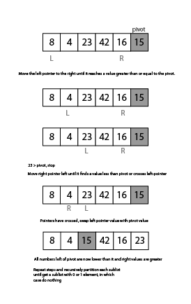
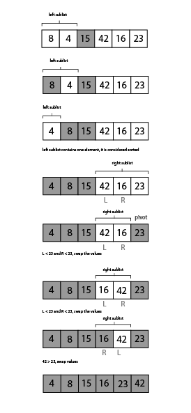

## [See Code](https://github.com/Mmarcos01/data-structures-and-algorithms/blob/main/python/sorting/quick_sort.py)

## [See Tests](https://github.com/Mmarcos01/data-structures-and-algorithms/blob/main/python/tests/test_quick_sort.py)

# Quick Sort

Quicksort is an in-place sorting algorithm that is a combination of partitions and recursion.

In quicksort the thing to do first partition the list.

Partitioning a list takes a value from the list called the 'pivot' and ensures all numbers less than its value ends up to the left of it and all values greater go to the right of it.

The right-most value is chosen to be the pivot in the example, though it could technically be any.

Assign "pointers" to the left-most value and the right most value of the list, excluding pivot.

Left pointer moves right until it reaches a value greater or equal to pivot.

Right pointer moves left until it reaches a value that is less than or equal to the pivot.

Swap the pivot with the value that the left pointer is holding

Partitioning ensures that all values to the left of the pivot are less than it, and all to the right are greater.

The values to the left of the pivot are considered in the left-sublist and the values to the right of the pivot are considered in the right-sublist.

Recursively call the quicksort function on itself to partition each sublist to get smaller sublists.

When a sublist contains zero or one value, it is considered sorted and doesn't need to move.

    Input: [8,4,23,42,16,15]
    Output: [4,8,15,16,23,42]

## Visual
### Partition

### Recursion

## Pseudo

    ALGORITHM QuickSort(arr, left, right)
        if left < right
            // Partition the array by setting the position of the pivot value
            DEFINE position <-- Partition(arr, left, right)
            // Sort the left
            QuickSort(arr, left, position - 1)
            // Sort the right
            QuickSort(arr, position + 1, right)

    ALGORITHM Partition(arr, left, right)
        // set a pivot value as a point of reference
        DEFINE pivot <-- arr[right]
        // create a variable to track the largest index of numbers lower than the defined pivot
        DEFINE low <-- left - 1
        for i <- left to right do
            if arr[i] <= pivot
                low++
                Swap(arr, i, low)

        // place the value of the pivot location in the middle.
        // all numbers smaller than the pivot are on the left, larger on the right.
        Swap(arr, right, low + 1)
        // return the pivot index point
        return low + 1

    ALGORITHM Swap(arr, i, low)
        DEFINE temp;
        temp <-- arr[i]
        arr[i] <-- arr[low]
        arr[low] <-- temp
