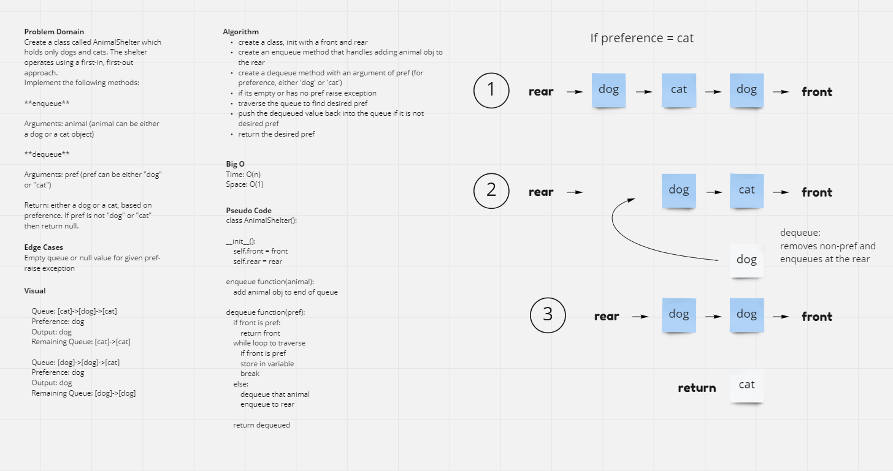
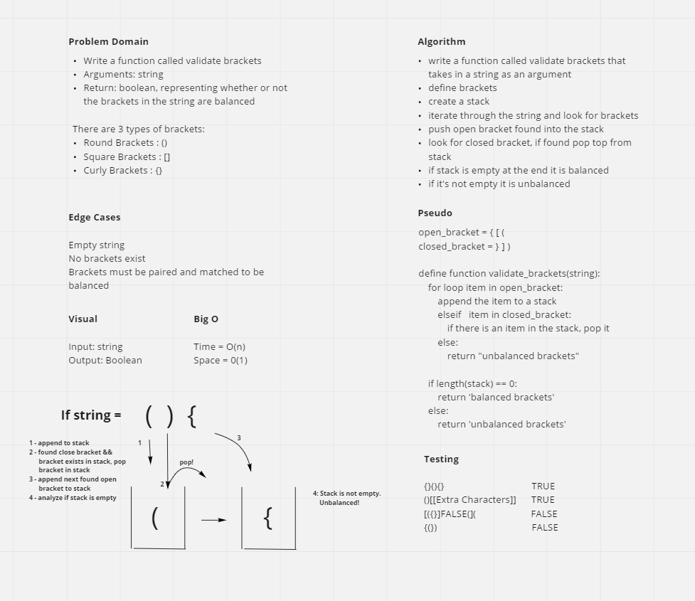

# Stacks and Queues

## Challenge 7 Summary

## Stack

Create a Stack class that has a top property. It creates an empty Stack when instantiated.
This object should be aware of a default empty value assigned to top when the stack is created.

The class should contain the following methods:

**push**

Arguments: value
adds a new node with that value to the top of the stack with an O(1) Time performance.

**pop**

Arguments: none
Returns: the value from node from the top of the stack
Removes the node from the top of the stack
Should raise exception when called on empty stack

**peek**

Arguments: none
Returns: Value of the node located at the top of the stack
Should raise exception when called on empty stack

**is empty**

Arguments: none
Returns: Boolean indicating whether or not the stack is empty.

### Queue

Create a Queue class that has a front property. It creates an empty Queue when instantiated.
This object should be aware of a default empty value assigned to front when the queue is created.

The class should contain the following methods:

**enqueue**

Arguments: value
adds a new node with that value to the back of the queue with an O(1) Time performance.

**dequeue**

Arguments: none
Returns: the value from node from the front of the queue
Removes the node from the front of the queue
Should raise exception when called on empty queue

**peek**

Arguments: none
Returns: Value of the node located at the front of the queue
Should raise exception when called on empty stack

**is empty**

Arguments: none
Returns: Boolean indicating whether or not the queue is empty

## Challenge 8 Summary

Implement a Queue using two Stacks.

PseudoQueue class will implement our standard queue interface (Enqueue, Dequeue)

Internally, utilize 2 Stack instances to create and manage the queue

Methods:

**enqueue**

Arguments: value
Inserts value into the PseudoQueue, using a first-in, first-out approach.

**dequeue**

Arguments: none
Extracts a value from the PseudoQueue, using a first-in, first-out approach

## Whiteboard

---

## Challenge 9 Summary

Create a class called AnimalShelter which holds only dogs and cats. The shelter operates using a first-in, first-out approach.
Implement the following methods:

**enqueue**

Arguments: animal (animal can be either a dog or a cat object)

**dequeue**

Arguments: pref (pref can be either "dog" or "cat")

Return: either a dog or a cat, based on preference. If pref is not "dog" or "cat" then return null.

## Whiteboard

## Collaborators

Davee Sok
Prabin Singh
Daniel Dills
Wondwosen
Garfield Grant

---

## Challenge 10 Summary

Write a function called validate brackets that takes in a string as an argument. Return a boolean, representing whether or not the brackets in the string are balanced.

## Whiteboard

---

## Resources
[geeksforgeeks.org](https://www.geeksforgeeks.org/check-for-balanced-parentheses-in-python/)

### Change Log

1.1: Completed testing for stacks and queues - 6 Jul 2021

1.2: Completed testing for pseudoqueue - 7 Jul 2021

1.2: Completed whiteboard for AnimalShelter - 12 Jul 2021

1.2: Completed whiteboard for bracket validation - 15 Jul 2021

